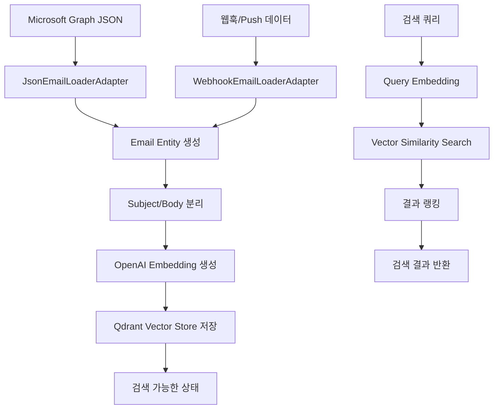

# 📧 이메일 시스템 구현 및 사용 가이드

## 📋 개요

이메일 시스템은 Microsoft Graph API에서 받은 이메일 JSON 데이터를 처리하여 벡터 검색이 가능한 형태로 저장하고, 의미 기반 검색을 제공하는 시스템입니다.

## 🏗️ 시스템 아키텍처

### 이메일 처리 플로우



### 핵심 컴포넌트

#### 1. Core Entities
```python
# core/entities/email.py
@dataclass
class Email:
    id: str
    original_id: str  # Microsoft Graph ID
    subject: str
    body_content: str
    created_datetime: datetime
    sender: EmailAddress
    to_recipients: List[EmailAddress]
    correspondence_thread: Optional[str]  # 회신 스레드 ID
    raw_data: Dict[str, Any]  # 원본 JSON
```

#### 2. Email Loader Port
```python
# core/ports/email_loader.py
class EmailLoaderPort(ABC):
    @abstractmethod
    async def load_from_json(self, json_data: Dict[str, Any]) -> List[Email]
    
    @abstractmethod
    async def load_from_webhook(self, webhook_data: Dict[str, Any]) -> List[Email]
```

#### 3. Email Processing UseCase
```python
# core/usecases/email_processing.py
class EmailProcessingUseCase:
    async def process_emails_from_json(self, json_data: Dict[str, Any])
    async def process_emails_from_webhook(self, webhook_data: Dict[str, Any])
```

## 📊 데이터 구조

### Microsoft Graph API 입력 형식
```json
{
  "@odata.context": "https://graph.microsoft.com/v1.0/$metadata#users('user-id')/messages",
  "value": [
    {
      "id": "AAMkAGE...",
      "subject": "PL25008aKRd - Approval Request",
      "body": {
        "contentType": "html",
        "content": "<html>...</html>"
      },
      "sender": {
        "emailAddress": {
          "name": "John Doe",
          "address": "john@example.com"
        }
      },
      "createdDateTime": "2025-05-29T02:01:56Z",
      "webLink": "https://outlook.office365.com/...",
      "conversationId": "AAQkAGE..."
    }
  ]
}
```

### Qdrant 저장 구조
```json
{
  "id": "email_{email_id}_{type}",
  "vector": [0.1, 0.2, ...],
  "payload": {
    "email_id": "original_email_id",
    "type": "subject|body",
    "correspondence_thread": "PL25008aKRd",
    "created_time": "2025-05-29T02:01:56Z",
    "subject": "Original subject",
    "web_link": "https://outlook.office365.com/...",
    "body_content": "Full body content",
    "sender_name": "John Doe",
    "sender_address": "john@example.com",
    "receiver_addresses": ["recipient@example.com"],
    "raw_data": {...}
  }
}
```

## 🚀 사용법

### 1. CLI를 통한 이메일 처리

#### 이메일 JSON 파일 처리
```bash
# 단일 JSON 파일 처리
python -m interfaces.cli.main email process-json --file sample_emails.json

# 여러 JSON 파일 처리
python -m interfaces.cli.main email process-json --file emails1.json --file emails2.json

# 메타데이터와 함께 처리
python -m interfaces.cli.main email process-json --file emails.json --metadata '{"source": "outlook", "batch_id": "001"}'
```

#### 이메일 검색
```bash
# 제목 검색
python -m interfaces.cli.main email search --query "approval request" --type subject

# 본문 검색
python -m interfaces.cli.main email search --query "meeting schedule" --type body

# 통합 검색
python -m interfaces.cli.main email search --query "project update" --type both
```

#### 통계 조회
```bash
# 이메일 처리 통계
python -m interfaces.cli.main email stats

# 특정 이메일 정보
python -m interfaces.cli.main email info --email-id "email_123"
```

### 2. REST API를 통한 이메일 처리

#### 이메일 JSON 업로드
```bash
curl -X POST "http://localhost:8000/api/emails/process" \
  -H "Content-Type: application/json" \
  -d @sample_emails.json
```

#### 웹훅 처리
```bash
curl -X POST "http://localhost:8000/api/emails/webhook" \
  -H "Content-Type: application/json" \
  -d '{
    "@odata.context": "webhook",
    "value": [...]
  }'
```

#### 이메일 검색
```bash
# 제목 검색
curl -X POST "http://localhost:8000/api/emails/search" \
  -H "Content-Type: application/json" \
  -d '{
    "query": "approval request",
    "search_type": "subject",
    "top_k": 5
  }'

# 본문 검색
curl -X POST "http://localhost:8000/api/emails/search" \
  -H "Content-Type: application/json" \
  -d '{
    "query": "meeting schedule",
    "search_type": "body",
    "top_k": 10
  }'
```

#### 이메일 목록 조회
```bash
# 전체 이메일 목록
curl "http://localhost:8000/api/emails/list"

# 페이지네이션
curl "http://localhost:8000/api/emails/list?limit=20&offset=40"

# 발신자별 필터
curl "http://localhost:8000/api/emails/list?sender=john@example.com"
```

#### 대화형 채팅
```bash
curl -X POST "http://localhost:8000/api/emails/chat" \
  -H "Content-Type: application/json" \
  -d '{
    "message": "Find emails about project deadlines",
    "context": []
  }'
```

### 3. Python 코드에서 직접 사용

```python
import asyncio
from config.adapter_factory import AdapterFactory
from core.usecases.email_processing import EmailProcessingUseCase

async def process_emails():
    # 어댑터 팩토리로 컴포넌트 생성
    factory = AdapterFactory()
    
    email_loader = factory.create_email_loader()
    embedding_model = factory.create_embedding_model()
    vector_store = factory.create_vector_store()
    config = factory.create_config()
    
    # 이메일 처리 유스케이스 생성
    email_usecase = EmailProcessingUseCase(
        email_loader=email_loader,
        embedding_model=embedding_model,
        vector_store=vector_store,
        config=config
    )
    
    # JSON 파일에서 이메일 처리
    with open('sample_emails.json', 'r') as f:
        json_data = json.load(f)
    
    result = await email_usecase.process_emails_from_json(json_data)
    print(f"Processed {result['processed_count']} emails")

# 실행
asyncio.run(process_emails())
```

## 🔧 설정

### 환경 변수 설정
```bash
# .env 파일
OPENAI_API_KEY=your_openai_api_key
QDRANT_HOST=localhost
QDRANT_PORT=6333
EMBEDDING_MODEL=text-embedding-3-small
VECTOR_STORE_TYPE=qdrant
EMAIL_LOADER_TYPE=json
```

### 설정 파일 (config/settings.py)
```python
class EmailSettings(BaseSettings):
    # 이메일 처리 설정
    email_loader_type: str = "json"
    max_emails_per_batch: int = 100
    
    # 임베딩 설정
    embedding_model: str = "text-embedding-3-small"
    max_content_length: int = 8191
    
    # 벡터 스토어 설정
    email_collection_name: str = "emails"
    vector_dimension: int = 1536
```

## 📈 성능 최적화

### 1. 배치 처리
```python
# 대량 이메일 처리 시 배치 크기 조정
email_usecase = EmailProcessingUseCase(
    batch_size=50,  # 한 번에 처리할 이메일 수
    max_workers=4   # 병렬 처리 워커 수
)
```

### 2. 임베딩 최적화
```python
# 긴 이메일 본문 처리
class EmailProcessingUseCase:
    async def _prepare_content_for_embedding(self, content: str) -> str:
        # HTML 태그 제거
        clean_content = self._clean_html_content(content)
        
        # 토큰 제한에 맞춰 자르기
        if len(clean_content) > self.max_content_length:
            clean_content = clean_content[:self.max_content_length]
        
        return clean_content
```

### 3. 메모리 관리
```python
# 스트리밍 방식으로 대용량 JSON 처리
async def process_large_json_file(self, file_path: str):
    with open(file_path, 'r') as f:
        for chunk in self._read_json_chunks(f):
            await self.process_emails_from_json(chunk)
            # 메모리 정리
            gc.collect()
```

## 🔍 검색 기능

### 1. 검색 타입
- **subject**: 이메일 제목에서만 검색
- **body**: 이메일 본문에서만 검색
- **both**: 제목과 본문 모두 검색 (가중 평균)

### 2. 필터링 옵션
```python
# 발신자별 필터
search_results = await email_retrieval.search_emails(
    query="project update",
    filters={"sender_address": "manager@company.com"}
)

# 날짜 범위 필터
search_results = await email_retrieval.search_emails(
    query="meeting",
    filters={
        "date_from": "2025-05-01",
        "date_to": "2025-05-31"
    }
)

# 회신 스레드별 필터
search_results = await email_retrieval.search_emails(
    query="approval",
    filters={"correspondence_thread": "PL25008aKRd"}
)
```

### 3. 결과 랭킹
```python
# 검색 결과는 다음 기준으로 랭킹
1. 벡터 유사도 점수 (0.0 ~ 1.0)
2. 이메일 중요도 (high, normal, low)
3. 최신성 (최근 이메일 우선)
4. 발신자 신뢰도
```

## 🚨 문제 해결

### 일반적인 문제들

#### 1. JSON 파싱 오류
```python
# 문제: Microsoft Graph JSON 구조가 예상과 다름
# 해결: JSON 구조 검증
if not email_loader.validate_json_structure(json_data):
    raise ValueError("Invalid email JSON structure")
```

#### 2. 임베딩 생성 실패
```python
# 문제: OpenAI API 호출 실패
# 해결: 재시도 로직 및 대체 모델
try:
    embeddings = await embedding_model.embed_texts(texts)
except Exception as e:
    # 재시도 또는 로컬 모델 사용
    embeddings = await fallback_embedding_model.embed_texts(texts)
```

#### 3. 벡터 스토어 연결 실패
```python
# 문제: Qdrant 서버 연결 불가
# 해결: 헬스 체크 및 대체 스토어
if not await vector_store.health_check():
    # Mock 스토어로 대체
    vector_store = MockVectorStoreAdapter()
```

### 성능 문제

#### 1. 느린 검색 속도
- **원인**: 대량의 벡터 데이터
- **해결**: 인덱스 최적화, 필터 사용

#### 2. 메모리 부족
- **원인**: 대량 이메일 일괄 처리
- **해결**: 배치 크기 조정, 스트리밍 처리

#### 3. API 응답 지연
- **원인**: 동기 처리
- **해결**: 비동기 처리, 백그라운드 태스크

## 📊 모니터링 및 로깅

### 로그 레벨별 정보
```python
# INFO: 일반적인 처리 정보
logger.info(f"Processed {count} emails successfully")

# WARNING: 주의가 필요한 상황
logger.warning(f"Email {email_id} has no content")

# ERROR: 처리 실패
logger.error(f"Failed to process email {email_id}: {error}")
```

### 메트릭 수집
```python
# 처리 통계
{
    "total_emails_processed": 1250,
    "successful_embeddings": 2500,  # subject + body
    "failed_embeddings": 0,
    "average_processing_time": "2.3s",
    "storage_usage": "45MB"
}
```

## 🔗 관련 문서

- [프로젝트 개요](01_project_overview.md)
- [설정 가이드](03_configuration_guide.md)
- [문제 해결](06_email_troubleshooting.md)
- [성능 최적화](07_performance_optimization.md)

---

**작성일**: 2025-05-29  
**버전**: 1.0  
**상태**: 활성
