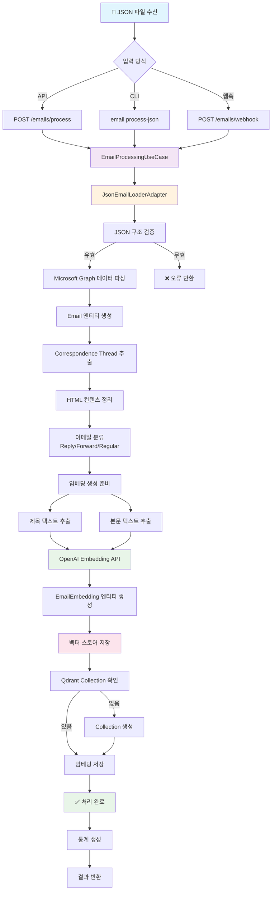
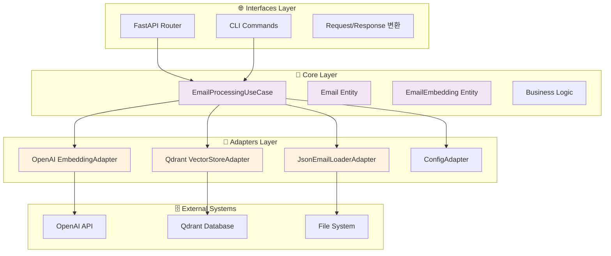

# 📧 이메일 처리 흐름도 (JSON → 데이터베이스)

https://gemini.google.com/app/d3e8baeeca924f96?hl=ko

## 🔄 전체 처리 플로우



## 📊 상세 데이터 변환 과정

```mermaid
flowchart LR
    subgraph "1️⃣ JSON 입력"
        A1[Microsoft Graph JSON]
        A2[{"@odata.context": "...",<br/>"value": [...]"}]
    end
    
    subgraph "2️⃣ 파싱 & 검증"
        B1[구조 검증]
        B2[필수 필드 확인]
        B3[이메일 배열 추출]
    end
    
    subgraph "3️⃣ Email 엔티티"
        C1[Email 객체 생성]
        C2[EmailAddress 파싱]
        C3[날짜 변환]
        C4[메타데이터 추출]
    end
    
    subgraph "4️⃣ 컨텐츠 처리"
        D1[HTML 태그 제거]
        D2[엔티티 변환]
        D3[Thread ID 추출]
        D4[텍스트 정리]
    end
    
    subgraph "5️⃣ 임베딩 생성"
        E1[제목 임베딩]
        E2[본문 임베딩]
        E3[벡터 생성<br/>1536차원]
    end
    
    subgraph "6️⃣ 데이터베이스 저장"
        F1[Qdrant Collection]
        F2[Vector + Payload]
        F3[메타데이터 저장]
    end
    
    A1 --> A2
    A2 --> B1
    B1 --> B2
    B2 --> B3
    B3 --> C1
    C1 --> C2
    C2 --> C3
    C3 --> C4
    C4 --> D1
    D1 --> D2
    D2 --> D3
    D3 --> D4
    D4 --> E1
    D4 --> E2
    E1 --> E3
    E2 --> E3
    E3 --> F1
    F1 --> F2
    F2 --> F3
```

## 🏗️ 아키텍처 레이어별 처리



## 📋 데이터 구조 변환

### 1. 입력 JSON (Microsoft Graph)
```json
{
  "@odata.context": "https://graph.microsoft.com/v1.0/$metadata#users('user-id')/messages",
  "value": [
    {
      "id": "AAMkAGE...",
      "subject": "PL25008aKRd - Maritime Safety Regulations",
      "body": {
        "contentType": "html",
        "content": "<div>Email content...</div>"
      },
      "sender": {
        "emailAddress": {
          "name": "Darko Dominovic",
          "address": "Darko.Dominovic@crs.hr"
        }
      },
      "createdDateTime": "2025-05-29T02:01:56Z"
    }
  ]
}
```

### 2. Email 엔티티
```python
Email(
    id="uuid-generated",
    original_id="AAMkAGE...",
    subject="PL25008aKRd - Maritime Safety Regulations",
    body_content="Email content...",  # HTML 제거됨
    sender=EmailAddress(name="Darko Dominovic", address="Darko.Dominovic@crs.hr"),
    correspondence_thread="PL25008aKRd",  # 추출됨
    created_datetime=datetime(2025, 5, 29, 2, 1, 56)
)
```

### 3. EmailEmbedding 엔티티
```python
EmailEmbedding(
    id="uuid_subject",
    email_id="uuid-generated",
    embedding_type="subject",
    vector=[0.1, 0.2, ..., 0.9],  # 1536차원
    content="PL25008aKRd - Maritime Safety Regulations",
    model="text-embedding-3-small"
)
```

### 4. Qdrant 저장 구조
```json
{
  "id": "uuid_subject",
  "vector": [0.1, 0.2, ..., 0.9],
  "payload": {
    "email_id": "uuid-generated",
    "embedding_type": "subject",
    "content": "PL25008aKRd - Maritime Safety Regulations",
    "correspondence_thread": "PL25008aKRd",
    "sender_name": "Darko Dominovic",
    "sender_address": "Darko.Dominovic@crs.hr",
    "created_time": "2025-05-29T02:01:56Z",
    "web_link": "https://outlook.office365.com/...",
    "has_attachments": false
  }
}
```

## 🔍 처리 단계별 상세 설명

### 1단계: JSON 수신 및 검증
- Microsoft Graph API 형식 확인
- 필수 필드 존재 여부 검증
- 이메일 배열 추출

### 2단계: 이메일 파싱
- 각 이메일을 Email 엔티티로 변환
- 발신자/수신자 정보 파싱
- 날짜 형식 변환

### 3단계: 컨텐츠 처리
- HTML 태그 제거 및 텍스트 정리
- Correspondence Thread ID 추출 (정규식)
- 이메일 유형 분류 (Reply/Forward/Regular)

### 4단계: 임베딩 생성
- 제목과 본문을 분리하여 처리
- OpenAI API를 통한 벡터 생성
- 배치 처리로 API 호출 최적화

### 5단계: 벡터 저장
- Qdrant Collection 존재 확인/생성
- 임베딩과 메타데이터 함께 저장
- 검색 최적화를 위한 인덱싱

### 6단계: 결과 반환
- 처리 통계 생성
- 성공/실패 상태 반환
- 로깅 및 모니터링

## 🚀 성능 최적화 포인트

1. **배치 임베딩**: 여러 텍스트를 한 번에 처리
2. **비동기 처리**: 모든 I/O 작업 비동기화
3. **메모리 관리**: 대용량 JSON 스트리밍 처리
4. **캐싱**: 중복 임베딩 방지
5. **Rate Limiting**: OpenAI API 제한 준수

## 🛡️ 오류 처리 및 복구

1. **JSON 파싱 오류**: 구조 검증 실패 시 상세 오류 메시지
2. **임베딩 실패**: 부분 실패 허용, 재시도 로직
3. **데이터베이스 오류**: 트랜잭션 롤백 및 복구
4. **네트워크 오류**: 지수 백오프 재시도
5. **메모리 부족**: 청킹 및 스트리밍 처리

이 흐름도는 JSON 파일 수신부터 Qdrant 데이터베이스 저장까지의 전체 과정을 보여주며, 각 단계에서의 데이터 변환과 처리 로직을 상세히 설명합니다.
