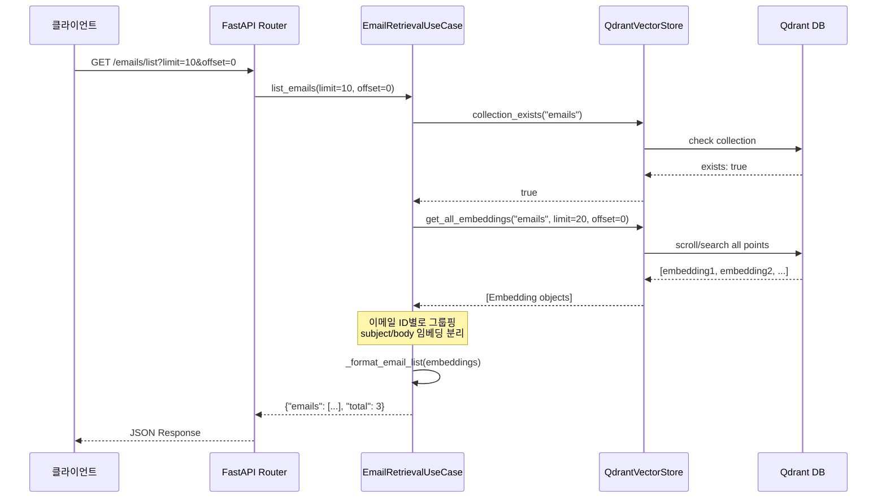
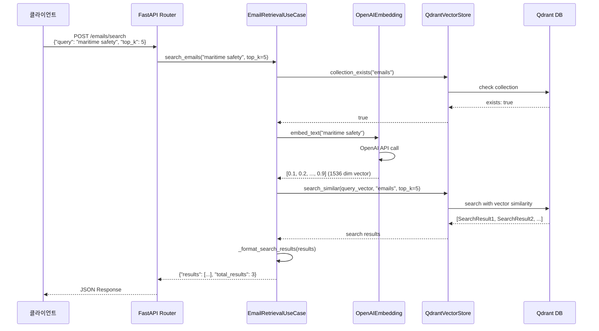
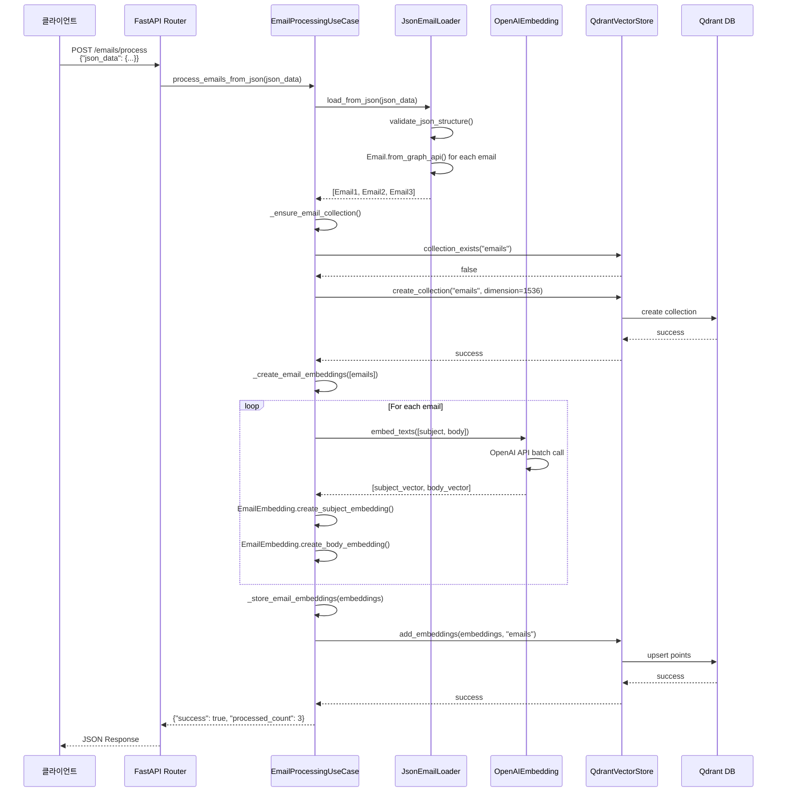
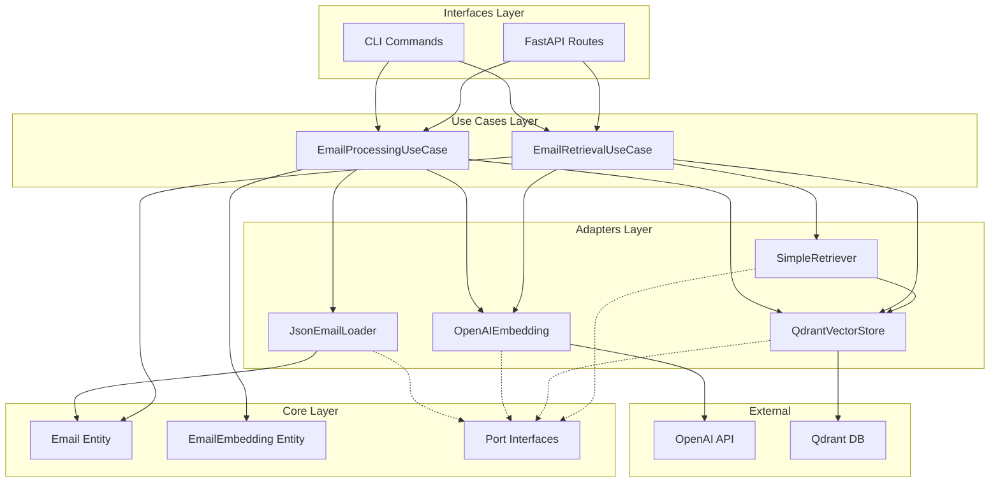

# 이메일 시스템 호출 흐름 분석

## 📋 목차
1. [이메일 목록 조회 흐름](#1-이메일-목록-조회-흐름)
2. [이메일 검색 흐름](#2-이메일-검색-흐름)
3. [이메일 처리 흐름](#3-이메일-처리-흐름)
4. [컴포넌트 간 의존성](#4-컴포넌트-간-의존성)

---

## 1. 이메일 목록 조회 흐름

### 🔄 API 호출 흐름


### 📝 상세 호출 스택
```
1. interfaces/api/email_list_routes.py:list_emails()
   ↓
2. core/usecases/email_retrieval.py:list_emails()
   ↓
3. adapters/vector_store/qdrant_email_adapter.py:collection_exists()
   ↓
4. adapters/vector_store/qdrant_email_adapter.py:get_all_embeddings()
   ↓
5. qdrant_client.scroll() → Qdrant DB
   ↓
6. core/usecases/email_retrieval.py:_format_email_list()
```

---

## 2. 이메일 검색 흐름

### 🔍 텍스트 검색 호출 흐름


### 📝 검색 상세 호출 스택
```
1. interfaces/api/email_search_routes.py:search_emails()
   ↓
2. core/usecases/email_retrieval.py:search_emails()
   ↓
3. adapters/embedding/openai_embedding.py:embed_text()
   ↓ 
4. OpenAI API (text-embedding-3-small)
   ↓
5. adapters/vector_store/qdrant_email_adapter.py:search_similar()
   ↓
6. qdrant_client.search() → Qdrant DB
   ↓
7. core/usecases/email_retrieval.py:_format_search_results()
```

---

## 3. 이메일 처리 흐름

### 📧 JSON 이메일 처리 호출 흐름


### 📝 처리 상세 호출 스택
```
1. interfaces/api/email_routes.py:process_emails()
   ↓
2. core/usecases/email_processing.py:process_emails_from_json()
   ↓
3. adapters/email/json_email_loader.py:load_from_json()
   ↓
4. core/entities/email.py:Email.from_graph_api()
   ↓
5. core/usecases/email_processing.py:_create_email_embeddings()
   ↓
6. adapters/embedding/openai_embedding.py:embed_texts()
   ↓
7. OpenAI API (batch embedding)
   ↓
8. core/entities/email.py:EmailEmbedding.create_*_embedding()
   ↓
9. adapters/vector_store/qdrant_email_adapter.py:add_embeddings()
   ↓
10. qdrant_client.upsert() → Qdrant DB
```

---

## 4. 컴포넌트 간 의존성

### 🏗️ 아키텍처 레이어별 의존성


### 🔄 실행 시 객체 생성 순서
```
1. Config 로딩 (settings.py)
   ↓
2. Adapter 인스턴스 생성
   - OpenAIEmbeddingAdapter(config)
   - QdrantEmailVectorStoreAdapter(host, port)
   - JsonEmailLoaderAdapter()
   - SimpleRetrieverAdapter(vector_store, embedding_model)
   ↓
3. UseCase 인스턴스 생성
   - EmailProcessingUseCase(loader, embedding, vector_store, config)
   - EmailRetrievalUseCase(retriever, embedding, vector_store, config)
   ↓
4. Interface 레이어 초기화
   - FastAPI app with dependency injection
   - CLI commands with adapter injection
```

---

## 🚀 성능 최적화 포인트

### 1. 배치 처리
- **임베딩**: 여러 텍스트를 한 번에 OpenAI API 호출
- **벡터 저장**: 여러 임베딩을 배치로 Qdrant에 저장

### 2. 캐싱 전략
- **임베딩 캐시**: 동일한 텍스트의 임베딩 재사용
- **검색 결과 캐시**: 자주 사용되는 쿼리 결과 캐싱

### 3. 비동기 처리
- **모든 I/O 작업**: async/await 패턴 사용
- **웹훅 처리**: 백그라운드 태스크로 처리

### 4. 메모리 관리
- **스트리밍**: 대용량 JSON 파일 스트리밍 처리
- **페이지네이션**: 대량 데이터 조회 시 페이징

---

## 🔧 디버깅 가이드

### 로그 추적 포인트
1. **API 진입점**: 요청 파라미터 로깅
2. **UseCase 시작**: 비즈니스 로직 시작점
3. **외부 API 호출**: OpenAI, Qdrant 호출 전후
4. **에러 발생점**: 예외 처리 및 에러 메시지
5. **응답 반환**: 최종 결과 로깅

### 성능 모니터링
- **응답 시간**: 각 레이어별 처리 시간
- **메모리 사용량**: 대용량 데이터 처리 시
- **API 호출 횟수**: OpenAI API 사용량 추적
- **벡터 DB 성능**: Qdrant 쿼리 성능

이 호출 흐름을 통해 시스템의 각 컴포넌트가 어떻게 상호작용하는지 명확히 파악할 수 있습니다.
