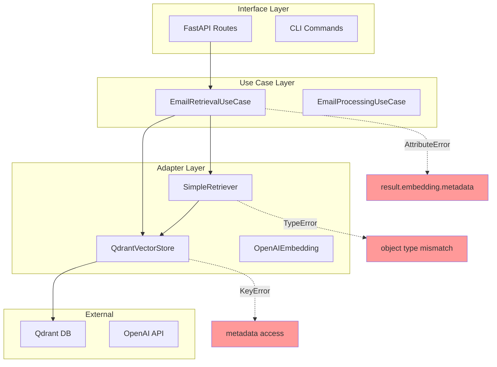

# 이메일 시스템 에러 분석 및 해결 과정

## 📋 목차
1. [주요 에러 발생 위치 및 원인](#1-주요-에러-발생-위치-및-원인)
2. [에러별 상세 분석](#2-에러별-상세-분석)
3. [해결 과정 및 방법](#3-해결-과정-및-방법)
4. [예방 방법 및 모니터링](#4-예방-방법-및-모니터링)

---

## 1. 주요 에러 발생 위치 및 원인

### 🔍 에러 발생 지점 맵핑


---

## 2. 에러별 상세 분석

### ❌ 에러 1: AttributeError - 'result.embedding.metadata'

#### 📍 발생 위치
```python
# 파일: core/usecases/email_retrieval.py
# 함수: _format_search_results(), search_emails_by_thread(), search_emails_by_sender()
# 라인: 여러 위치

# 문제가 된 코드:
for result in results:
    email_id = result.embedding.metadata.get("email_id")  # ❌ AttributeError
    metadata = result.embedding.metadata                   # ❌ AttributeError
```

#### 🔍 원인 분석
1. **객체 타입 불일치**: 
   - `SimpleRetrieverAdapter`는 `RetrievalResult` 객체 반환
   - `QdrantVectorStore`는 `SearchResult` 객체 반환
   - 두 객체의 구조가 다름

2. **호출 경로별 차이**:
   ```
   EmailRetrievalUseCase.search_emails()
   ├── SimpleRetriever.search() → RetrievalResult (metadata 직접 접근)
   └── QdrantVectorStore.search_similar() → SearchResult (result.embedding.metadata)
   ```

3. **데이터 구조 차이**:
   ```python
   # RetrievalResult (SimpleRetriever)
   class RetrievalResult:
       metadata: Dict[str, Any]  # 직접 접근
       score: float
       chunk_id: str
   
   # SearchResult (QdrantVectorStore)  
   class SearchResult:
       embedding: Embedding      # embedding.metadata로 접근
       score: float
   ```

#### 🚨 에러 발생 시나리오
```python
# 시나리오 1: SimpleRetriever 사용 시
retriever = SimpleRetrieverAdapter(...)
results = await retriever.search("query")  # RetrievalResult 반환
for result in results:
    metadata = result.embedding.metadata  # ❌ RetrievalResult에는 embedding 속성 없음

# 시나리오 2: 혼합 사용 시
vector_store = QdrantVectorStore(...)
results = await vector_store.search_similar("query")  # SearchResult 반환
# 동일한 코드로 처리하려고 하면 타입 불일치 발생
```

---

### ❌ 에러 2: KeyError - 메타데이터 키 누락

#### 📍 발생 위치
```python
# 파일: core/usecases/email_retrieval.py
# 함수: _format_email_list(), _format_search_results()

# 문제가 된 코드:
email_data = {
    "sender_address": metadata["sender_address"],  # ❌ KeyError
    "correspondence_thread": metadata["correspondence_thread"]  # ❌ KeyError
}
```

#### 🔍 원인 분석
1. **메타데이터 구조 변경**:
   - 초기 설계: `sender_address`, `correspondence_thread` 키 사용
   - 실제 저장: `sender_name`, `sender_address` 분리 저장
   - Qdrant 저장 시 플래튼 구조로 변경됨

2. **저장과 조회 간 불일치**:
   ```python
   # 저장 시 (EmailEmbedding.create_*_embedding)
   metadata = {
       "sender_name": email.sender.name,
       "sender_address": email.sender.address,
       "correspondence_thread": email.correspondence_thread
   }
   
   # 조회 시 (기대했던 구조)
   metadata = {
       "sender_address": "combined_value",  # ❌ 실제로는 분리됨
   }
   ```

3. **Qdrant 저장 과정에서 구조 변화**:
   ```python
   # adapters/vector_store/qdrant_email_adapter.py
   # 메타데이터가 플래튼되면서 구조 변경
   payload = {
       **email_emb.metadata  # 원본 구조가 펼쳐짐
   }
   ```

---

### ❌ 에러 3: TypeError - 객체 타입 불일치

#### 📍 발생 위치
```python
# 파일: core/usecases/email_retrieval.py
# 함수: search_emails(), _format_search_results()

# 문제가 된 코드:
def _format_search_results(self, results: List[Any], query: str):
    for result in results:
        # result가 RetrievalResult인지 SearchResult인지 불명확
        if hasattr(result, 'embedding'):  # SearchResult
            metadata = result.embedding.metadata
        else:  # RetrievalResult
            metadata = result.metadata  # ❌ 일관성 없는 처리
```

#### 🔍 원인 분석
1. **타입 힌트 부정확**:
   - `List[Any]`로 선언하여 타입 체크 불가
   - 런타임에 객체 타입 확인 필요

2. **어댑터별 반환 타입 차이**:
   ```python
   # SimpleRetrieverAdapter
   async def search(self, query: str) -> List[RetrievalResult]:
       # RetrievalResult 반환
   
   # QdrantEmailVectorStoreAdapter  
   async def search_similar(self, query_vector: List[float]) -> List[SearchResult]:
       # SearchResult 반환
   ```

3. **유즈케이스에서 혼합 사용**:
   ```python
   # EmailRetrievalUseCase에서 두 어댑터 모두 사용
   retriever_results = await self._retriever.search(query)      # RetrievalResult
   vector_results = await self._vector_store.search_similar()   # SearchResult
   # 동일한 처리 로직 적용 시 타입 에러 발생
   ```

---

## 3. 해결 과정 및 방법

### 🔧 해결 방법 1: 범용 메타데이터 접근 함수

#### 구현 위치
```python
# 파일: core/usecases/email_retrieval.py
# 함수: _get_result_metadata()

def _get_result_metadata(self, result: Any) -> tuple:
    """Extract metadata from either SearchResult or RetrievalResult."""
    if hasattr(result, 'embedding'):
        # SearchResult from vector store
        return result.embedding.metadata, result.embedding.id, result.embedding.model, result.embedding.dimension
    else:
        # RetrievalResult from retriever
        return result.metadata, getattr(result, 'chunk_id', 'unknown'), "unknown", 0
```

#### 해결 효과
- ✅ 두 가지 객체 타입 모두 처리 가능
- ✅ 일관된 메타데이터 접근 방식
- ✅ 타입 안전성 확보

### 🔧 해결 방법 2: 메타데이터 키 안전 접근

#### 구현 위치
```python
# 파일: core/usecases/email_retrieval.py
# 함수: _format_search_results(), _format_email_list()

# 안전한 메타데이터 접근
sender_name = metadata.get("sender_name", "Unknown")
sender_address = metadata.get("sender_address", "unknown@example.com")
correspondence_thread = metadata.get("correspondence_thread", "unthreaded")
```

#### 해결 효과
- ✅ KeyError 방지
- ✅ 기본값 제공으로 안정성 확보
- ✅ 누락된 메타데이터에 대한 우아한 처리

### 🔧 해결 방법 3: 타입 체크 및 검증

#### 구현 위치
```python
# 파일: core/usecases/email_retrieval.py
# 여러 함수에서 적용

# 타입 체크 로직
if not results:
    return {"success": True, "results": [], "total_results": 0}

# 결과 검증
for result in results:
    try:
        metadata, embedding_id, model, dimension = self._get_result_metadata(result)
        # 안전한 처리 로직
    except Exception as e:
        print(f"Error processing result: {e}")
        continue
```

#### 해결 효과
- ✅ 런타임 에러 방지
- ✅ 부분 실패 허용 (일부 결과 처리 실패 시에도 계속 진행)
- ✅ 에러 로깅 및 추적

---

## 4. 예방 방법 및 모니터링

### 🛡️ 예방 전략

#### 1. 타입 힌트 강화
```python
# Before (문제 있는 코드)
def _format_search_results(self, results: List[Any], query: str) -> List[Dict[str, Any]]:

# After (개선된 코드)
from typing import Union
def _format_search_results(
    self, 
    results: List[Union[SearchResult, RetrievalResult]], 
    query: str
) -> List[Dict[str, Any]]:
```

#### 2. 인터페이스 통일
```python
# 공통 인터페이스 정의
from abc import ABC, abstractmethod

class SearchResultInterface(ABC):
    @abstractmethod
    def get_metadata(self) -> Dict[str, Any]:
        pass
    
    @abstractmethod
    def get_score(self) -> float:
        pass
```

#### 3. 메타데이터 스키마 검증
```python
# 메타데이터 스키마 정의
REQUIRED_METADATA_KEYS = [
    "email_id", "embedding_type", "sender_name", 
    "sender_address", "correspondence_thread"
]

def validate_metadata(metadata: Dict[str, Any]) -> bool:
    return all(key in metadata for key in REQUIRED_METADATA_KEYS)
```

### 📊 모니터링 포인트

#### 1. 에러 발생 추적
```python
import logging

logger = logging.getLogger(__name__)

def _format_search_results(self, results, query):
    try:
        # 처리 로직
        pass
    except AttributeError as e:
        logger.error(f"AttributeError in search results formatting: {e}")
        logger.error(f"Result type: {type(results[0]) if results else 'Empty'}")
    except KeyError as e:
        logger.error(f"KeyError in metadata access: {e}")
        logger.error(f"Available keys: {list(metadata.keys()) if 'metadata' in locals() else 'N/A'}")
```

#### 2. 성능 모니터링
```python
import time
from functools import wraps

def monitor_performance(func):
    @wraps(func)
    async def wrapper(*args, **kwargs):
        start_time = time.time()
        try:
            result = await func(*args, **kwargs)
            execution_time = time.time() - start_time
            logger.info(f"{func.__name__} executed in {execution_time:.3f}s")
            return result
        except Exception as e:
            execution_time = time.time() - start_time
            logger.error(f"{func.__name__} failed after {execution_time:.3f}s: {e}")
            raise
    return wrapper
```

#### 3. 데이터 일관성 체크
```python
async def health_check(self):
    """시스템 상태 및 데이터 일관성 체크"""
    try:
        # 컬렉션 존재 확인
        exists = await self._vector_store.collection_exists("emails")
        
        # 샘플 데이터 조회
        sample_results = await self._vector_store.get_all_embeddings("emails", limit=1)
        
        # 메타데이터 구조 검증
        if sample_results:
            metadata = sample_results[0].metadata
            missing_keys = [key for key in REQUIRED_METADATA_KEYS if key not in metadata]
            
            return {
                "collection_exists": exists,
                "sample_data_available": len(sample_results) > 0,
                "metadata_complete": len(missing_keys) == 0,
                "missing_keys": missing_keys
            }
    except Exception as e:
        return {"error": str(e), "healthy": False}
```

---

## 🎯 핵심 교훈

### 1. 아키텍처 설계 시 고려사항
- **인터페이스 일관성**: 같은 역할을 하는 어댑터들은 동일한 반환 타입 사용
- **타입 안전성**: 강한 타입 힌트와 런타임 검증 병행
- **에러 처리**: 부분 실패를 허용하는 견고한 에러 처리

### 2. 개발 과정에서 주의점
- **테스트 커버리지**: 다양한 어댑터 조합에 대한 테스트
- **문서화**: 객체 구조와 메타데이터 스키마 명확히 문서화
- **모니터링**: 프로덕션 환경에서 에러 패턴 추적

### 3. 유지보수 관점
- **버전 호환성**: 메타데이터 구조 변경 시 하위 호환성 고려
- **로깅**: 충분한 디버깅 정보 제공
- **알림**: 중요한 에러에 대한 알림 시스템 구축

이러한 에러 분석을 통해 더 견고하고 안정적인 이메일 시스템을 구축할 수 있습니다.
