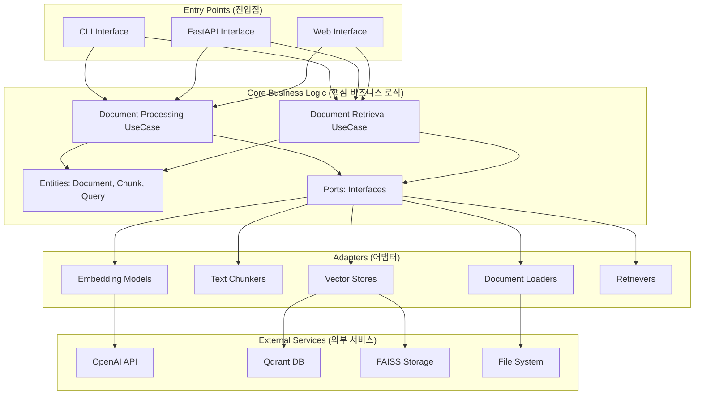
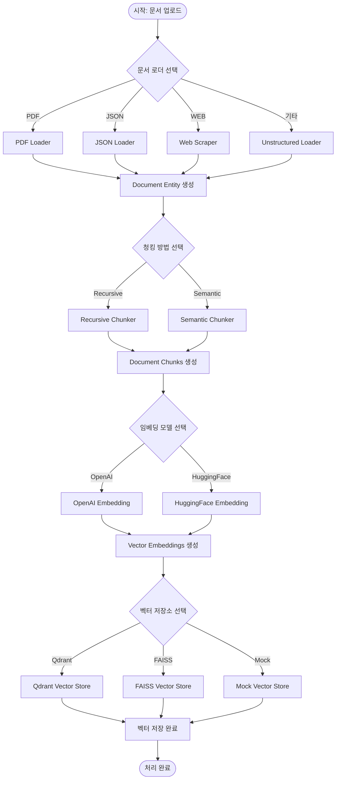
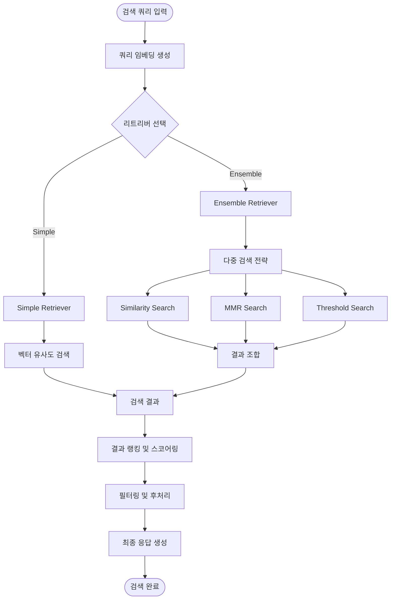
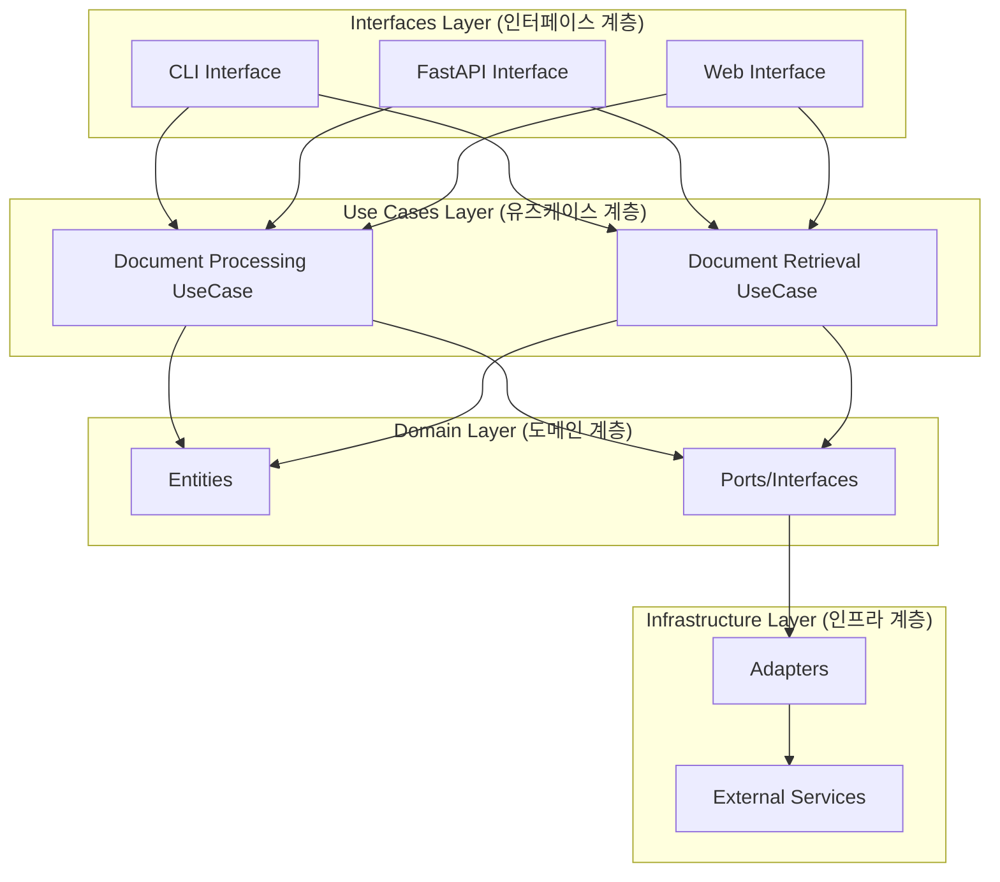
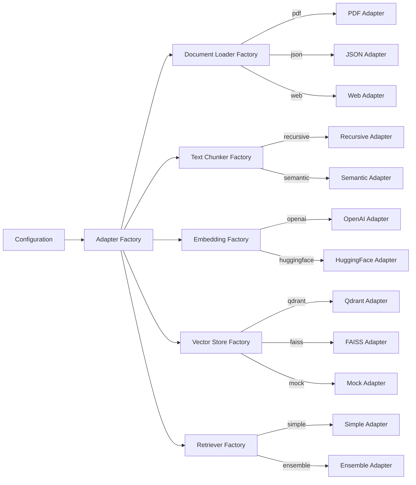
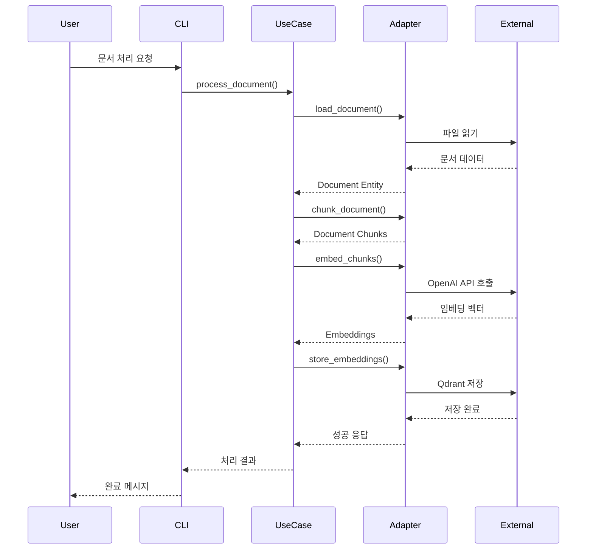
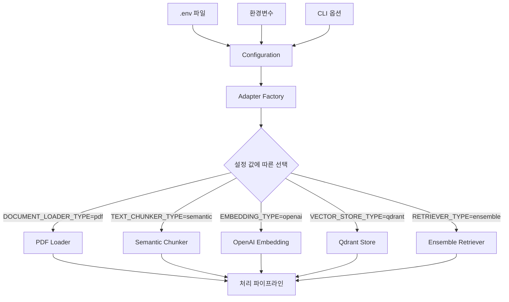
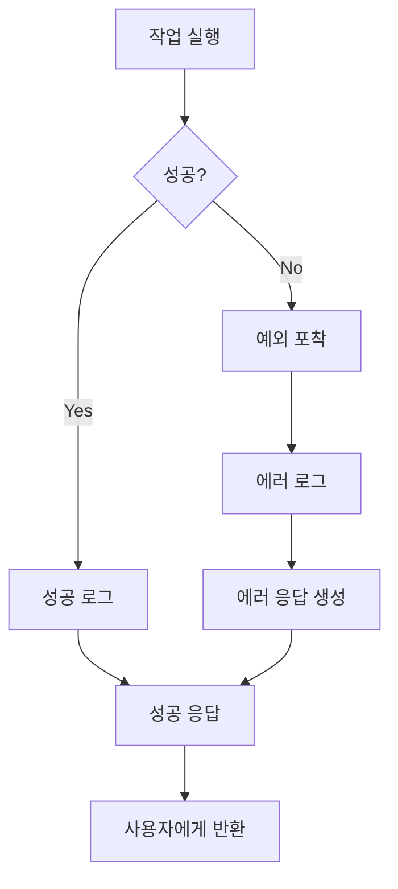

# 프로젝트 전체 흐름도

## 1. 시스템 아키텍처 개요

## 2. 문서 처리 흐름 (Document Processing Flow)

## 3. 문서 검색 흐름 (Document Retrieval Flow)

## 4. 클린 아키텍처 레이어 구조

## 5. 어댑터 팩토리 패턴

## 6. 데이터 흐름 (Data Flow)

## 7. 설정 기반 컴포넌트 선택

## 8. 에러 처리 및 로깅

이 흐름도들은 프로젝트의 전체적인 구조와 데이터 흐름을 보여주며, 클린 아키텍처 원칙에 따라 각 계층이 어떻게 상호작용하는지 명확하게 표현합니다.
